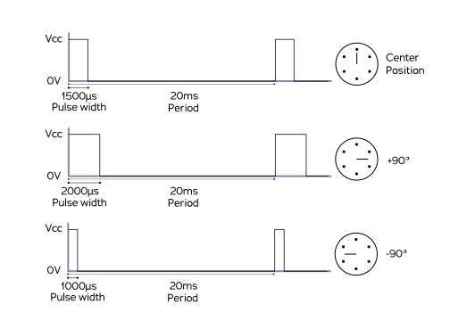

# Acutators

You have several options to control your car's servo and motors, ranging from directly with the RaspberryPi pins to using dedicated third-party servo driver boards.

## Control with an I2C servo driver board. 

A standard RC car is equiped with a steering servo for turning the front wheels and an ESC (Electronic Speed Controller) to control the speed of the DC motor driving the wheels.  Both the steering servo and the ESC take a PWM (Pulse Width Modulation) control signal.  A PWM signal is simply a square wave pulse of a certain duration and frequency.  In the case of the steering servo the PWM signal determines the position of the servo's arm, which is generally between 0 degrees (full right) and 180 degrees (full left).  In the case of the ESC the PWM signal determine the direction and speed of the drive motor, from full reverse, through stopped, to full forward.

The hardware configuration of the PCA9685 I2C servro driver board is described in the overall setup instructions [here](/guide/build_hardware/)

- Standard RC servo pulses range from 1 millisecond (full reverse for ESC, fully left for servo) to 2 milliseconds (full forward for ESC, full right for servo) with 1.5 milliseconds being neutral (stopped for ESC, straight for servo).
- These pulses are typically send at 50 hertz (one duty cycle every 20 milliseconds). One duty cycle includes a perion where the signal is brought high followed by a perior where the signal is brough low.  This means that, using the standard 50hz frequency, a 1 ms pulse (1 ms high followed by 19 ms low) represents a 5% duty cycle and a 2 ms pulse represents a 10% duty cycle.
- The important part is the length of the pulse; it must be in the range of 1 ms to 2ms.  



- So this means that if a different frequency is used, then the duty cycle must be adjusted in order to get the 1ms to 2ms pulse.
- For instance, if a 60hz frequency is used, then a 1 ms pulse requires a duty cycle of 0.05 * 60 / 50 = 0.06 (6%) duty cycle
- We default the frequency of our PCA9685 to 60 hz, so pulses in config are generally based on 60hz frequency and 12 bit values. We use 12 bit values because the PCA9685 has 12 bit resolution. So a 1 ms pulse is 0.06 * 4096 ~= 246, a neutral pulse of 0.09 duty cycle is 0.09 * 4096 ~= 367 and full forward pulse of 0.12 duty cycles is 0.12 * 4096 ~= 492
- These are generalizations that are useful for understanding the underlying api call arguments.  The final choice of duty-cycle/pulse length depends on your hardware and perhaps your strategy (you may not want to go too fast,  and so you may choose is low max throttle pwm)

## Direct control with the RaspberryPi GPIO pins. 

Please follow the instructions [here](/parts/rc/)

## Control with the Robo HAT MM1 board. 

Please follow the instructions [here](https://robohatmm1-docs.readthedocs.io/en/latest/)

## Arduino
Arduino can be used in the following fashion to generate PWM signals to control the steering and throttle.

For now the Arduino mode is only tested on the [Latte Panda Delta (LP-D)](https://www.lattepanda.com/products/lattepanda-delta-432.html) board.
However it should be straigtforward to use it with Raspberry Pi / Jetson Nano (instead of PCA 9685).

Refer to the below block diagram to understand where things fits in.


Arduino board should be running the standard firmata sketch (This sketch comes by default when you download the arduino tool). Load the standard firmata sketch (from _Examples > Firmata > StandardFirmata_) onto the Arduino.
 
Further **pymata_aio_** python package needs to be installed on the car computer via _pip3 install pymata_aio_.

As shown in the block-diagram above LattePanda combines both the x86 CPU and the Connected Arduino into a single board.

The following diagram shows how to connect the Arduino pins to steering servo and ESC.


Note that the power for the servo is provided by the ESC battery elemininator circuit (BEC) which most ESC's provide.
This is done to avoid supplying the entire servo power from Arduino's 5v.
In large RC cars the servo can drag up to 2 amps, which lead to a destruction of the Arduino.

### Calibration
Note that the calibration procedure/values are slightly different for the Arduino (than PCA9685).
Note that 90 is the usual midpoint (i.e. 1.5 ms pulse width at 50 Hz), so it is recommended to start
 with 90 and adjust +/- 5 until you figure the desired range for steering / throttle.
```bash
(env1) jithu@jithu-lp:~/master/pred_mt/lp/001/donkey$ donkey calibrate --arduino --channel 6
using donkey v2.6.0t ...

pymata_aio Version 2.33	Copyright (c) 2015-2018 Alan Yorinks All rights reserved.

Using COM Port:/dev/ttyACM0

Initializing Arduino - Please wait...
Arduino Firmware ID: 2.5 StandardFirmata.ino
Auto-discovery complete. Found 30 Digital Pins and 12 Analog Pins


Enter a PWM setting to test(0-180)95
Enter a PWM setting to test(0-180)90
Enter a PWM setting to test(0-180)85
...
```
Note the **--arduino** switch passed to the calibrate command. Further note that the arduino pin being
 calibrated is passed via the **--channel** parameter.

### Using the arduino actuator part

The following snippet illustrates how to exercise the Arduino actuator in the drive() loop:

```python
    #Drive train setup
    arduino_controller = ArduinoFirmata(
                                    servo_pin=cfg.STEERING_ARDUINO_PIN,
                                    esc_pin=cfg.THROTTLE_ARDUINO_PIN)

    steering = ArdPWMSteering(controller=arduino_controller,
                        left_pulse=cfg.STEERING_ARDUINO_LEFT_PWM,
                        right_pulse=cfg.STEERING_ARDUINO_RIGHT_PWM)

    throttle = ArdPWMThrottle(controller=arduino_controller,
                        max_pulse=cfg.THROTTLE_ARDUINO_FORWARD_PWM,
                        zero_pulse=cfg.THROTTLE_ARDUINO_STOPPED_PWM,
                        min_pulse=cfg.THROTTLE_ARDUINO_REVERSE_PWM)

    V.add(steering, inputs=['user/angle'])
    V.add(throttle, inputs=['user/throttle'])
```

Refer to templates/arduino_drive.py for more details.
