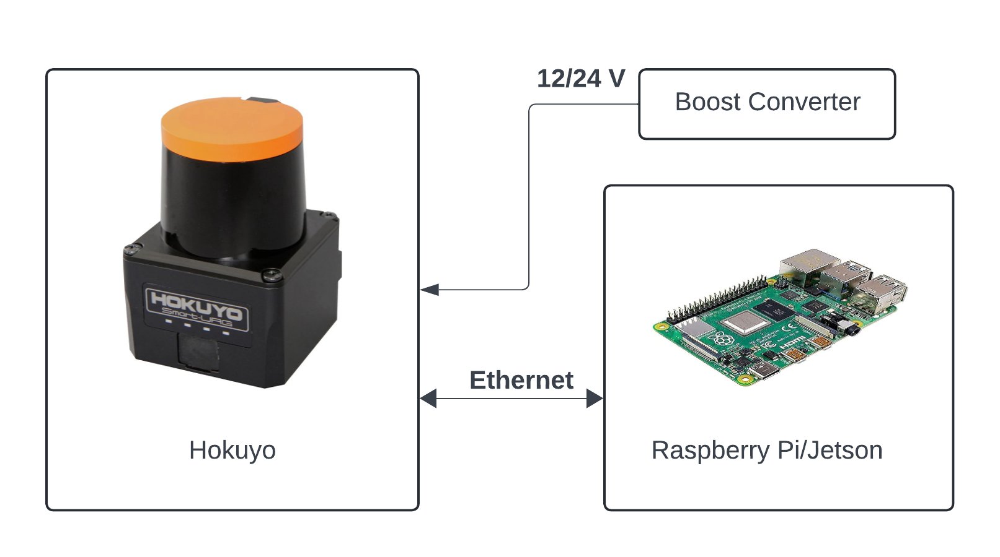

# Lidar

A Lidar sensor can be used with Donkeycar to provide obstacle avoidance or to help navigate on tracks with walls. It records data along with the camera during training. However, there are no deep learning autopilots which currently use recorded lidar information.


 
## Supported Lidars

We currently only support the RPLidar and Hokuyo LX series of sensors, but will be adding support for the YDLidar series soon. 

We recommend the [$99 A1M8](https://amzn.to/3vCabyN) (12m range) 

## RPLidar Setup

### Hardware Setup 

Mount the Lidar underneath the camera canopy as shown above (the RPLidar A2M8 is used there, but the A1M8 mounting is the same). You can velcro the USB adapter under the Donkey plate and use a short USB cable to connect to one of your RPi or Nano USB ports. It can be powered by the USB port so there's no need for an additional power supply.

### Software Setup 

Lidar requires the glob library to be installed. If you don't already have that, install it with `pip3 install glob2`

Also install the Lidar driver: `pip install Adafruit_CircuitPython_RPLIDAR`


Then go to the lidarcar directory and edit the myconfig.py file to ensure that the Lidar is turned on. The upper and lower limits should be set to reflect the areas you want your Lidar to "look at", omitting the areas that are blocked by parts of the car body. An example is shown below. For the RPLidar series, 0 degrees is in the direction of the motor (in the case of the A1M8) or cable (in the case of the A2M8)

```
# LIDAR
USE_LIDAR = True
LIDAR_TYPE = 'RP' #(RP|YD)
LIDAR_LOWER_LIMIT = 90 # angles that will be recorded. Use this to block out obstructed areas on your car and/or to avoid looking backwards. Note that for the RP A1M8 Lidar, "0" is in the direction of the motor 
LIDAR_UPPER_LIMIT = 270
```
 

## Setup (Hokuyo)

### Hardware Setup

 

A Hokuyo Lidar must be mounted from the bottom using M3 screws. The bottom of the lidar generates a significant amount of heat, so it is recommended to either raise it using standoffs or with a [heatsink](https://racecarj.com/products/aluminum-heat-sink-for-hokuyo-ust-10lx). 

LX-series lidars (e.g Hokuyo UST-10LX, used in F1Tenth cars) accept a voltage range from 10-30 V, with 12 V or 24 V recommended. The most straightforward method for powering the lidar is by cutting off the JST connector at the end and directly soldering the power cables (see [datasheet](https://autonomoustuff.com/-/media/Images/Hexagon/Hexagon%20Core/autonomousstuff/pdf/hokuyo-ust-10lx-datasheet.ashx?la=en&hash=95B57270899F50608C18BF48CC1AD043)) to a boost converter connected to a battery. You should use a multimeter to verify the voltage of the boost converter before wiring it up in order to not fry this very expensive piece of hardware. 

The Ethernet cable should also be connected to your central computer (Pi, Jetson, etc.). 

### Software Setup
You will need to assign an IP to the ethernet interface on your Raspberry Pi (or Jetson, etc.). Refer to [f1tenth docs](https://f1tenth.readthedocs.io/en/stable/getting_started/firmware/firmware_hokuyo10.html) on how to do this with Ubuntu. For Raspbian, you can edit `/etc/interface.d/` by creating a new file called `eth0` (or the name of your ethernet interface) and then creating a rule to put the interface on the same subnet as the Lidar. Once this is completed, you can verify setup by pinging the lidar at `192.168.0.10`.

To get the Hokuyo working with Donkey, install the Hokuyo python package: `pip install git+https://github.com/mgagvani/hokuyolx.git`. From there, set the Lidar type in the Donkey configuration as detailed above. 

If you want to visualize the Lidar, you can create a "virtual camera" which shows a visualization of the Lidar's measurements. To do this, set the camera type in `myconfig.py` to `LIDAR_PLOT`. 

## Template support
Neither the [deep learning template](/guide/train_autopilot/#deep-earning-autopilot) nor the [path follow template](/guide/path_follow/path_follow/) supports Lidar data directly.  There is an issue to [add Lidar data to the deep learning template](https://github.com/autorope/donkeycar/issues/910).  Lidar would also be very useful in the [path follow template](/guide/path_follow/path_follow/) for obstacle detection and avoidance.  If you are interested in working on such projects, please [join the discord community](https://www.donkeycar.com/community.html) and let us know; we will be happy to provide you with support.


