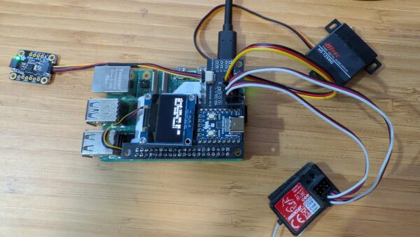

# Donkeycar RC Hat


If you started with a ready-to-run RC car, it probably came with a RC controller. Good news: you can use it with Donkeycar, using the RC controller for manual driving. For this, we recommend the Donkeycar RC hat, shown above, which handles all the wiring for you, along with including an OLED screen. 

The Donkeycar RC hat can be purchased from the [Donkeycar Store](https://www.diyrobocars.com/shop/). Instructions for setting it up and using it are [here](https://www.diyrobocars.com/2024/12/22/using-the-rc-hat/)

### Troubleshooting

If you are unable to start the car, ensure that the `Adafruit_SSD1306` package is installed in your virtual environment. This should automatically be installed, if you are using a recent version of `donkeycar`.

```bash
pip install Adafruit_SSD1306
```

## Encoder
If you're using a standard [wheel encoder](odometry.md), you can plug it into the "Encoder" pins, then setup the encoder configuration in your myconfig.py to use the pin that is exposed by the RC hat's encoder header.
